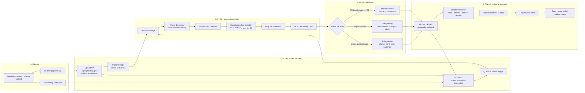

# AI Grading Pipeline Architecture

## Step-by-step flow

1. The teacher or hardware device uploads a student paper image. The answer key and rubric provide the scoring standard.
2. Vercel receives the upload, stores the image, creates a job record, and triggers the Python worker.
3. The Python worker downloads the image, detects the paper boundary, corrects perspective, finds question-number anchors such as `一、` and `二、`, crops each question from one anchor to the next, and runs OCR on every crop.
4. The grading router decides how to score each question:
   - low OCR confidence goes to teacher review;
   - simple objective or low-grade language questions use rules;
   - complex short-answer questions go to the LLM.
5. The worker sends results back to Vercel. The teacher sees each crop, recognized answer, score, reason, and can confirm or edit before exporting the final marked sheet.

## Current implementation status

- Implemented: Next.js UI, local upload API, hardware upload API, Kimi grading API, in-memory job record, worker callback, demo review and result pages.
- Partial: Vercel Blob storage is supported when `BLOB_READ_WRITE_TOKEN` is configured.
- Implemented in worker: paper correction, OCR-driven question anchor detection, template fallback, crop confidence status, crop/OCR result callback.
- Production work needed: persistent database, queue, device authentication, real OpenCV/OCR, saved teacher edits, and real export generation.

## No Manual Box Adjustment

Teachers should not drag or resize crop boxes. If OCR cannot find enough question anchors, the worker falls back to the current paper template and marks low-confidence crops as `needs_rescan`. The UI should ask for a better photo instead of exposing a box editor.
