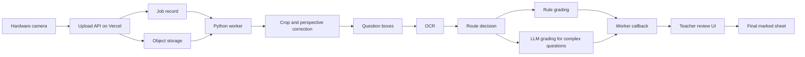

# AI Grading Pipeline Architecture

```mermaid
flowchart LR
  A["Hardware camera"] --> B["Upload API on Vercel"]
  B --> C["Object storage"]
  B --> D["Job record"]
  D --> E["Python worker"]
  C --> E
  E --> F["Crop and perspective correction"]
  F --> G["Question boxes"]
  G --> H["OCR"]
  H --> I["Route decision"]
  I --> J["Rule grading"]
  I --> K["LLM grading for complex questions"]
  J --> L["Worker callback"]
  K --> L
  L --> M["Teacher review UI"]
  M --> N["Final marked sheet"]
```

The default teacher UI hides this complexity. Teachers see the cropped question, recognized answer, score, reason, and confirmation controls.
