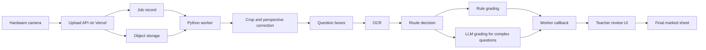

# AI Grading Pipeline Demo Implementation Plan

> **For agentic workers:** REQUIRED SUB-SKILL: Use superpowers:subagent-driven-development (recommended) or superpowers:executing-plans to implement this plan task-by-task. Steps use checkbox (`- [ ]`) syntax for tracking.

**Goal:** Build a Vercel-ready web demo that shows the full AI marking pipeline from hardware photo input to per-question crop, OCR, low-token grading, teacher correction, and final annotated result.

**Architecture:** Use a Next.js App Router web app for the interactive demo, with mocked processing data first and clean interfaces for replacing mocks with real image-processing jobs. Keep heavy crop/OCR work outside Vercel Functions in a Python worker service, while Vercel handles UI, uploads, API callbacks, job state, and final visualization.

**Tech Stack:** Next.js 15, React 19, TypeScript, Tailwind CSS, shadcn/ui-style components if desired, Vercel Blob for uploaded images, optional Neon Postgres for persisted jobs, Python worker with OpenCV + PaddleOCR/PP-StructureV3 + optional Mathpix or Google Document AI fallback, OpenAI-compatible LLM API only for complex questions.

---

## Product Reading Summary

Existing files reviewed:

- `产品设计书.md`: Defines the core path: hardware captures stable images, software crops, locates questions, OCRs handwriting, routes simple questions to rules, and only sends complex questions to LLMs.
- `需求文档.md`: Defines P0 requirements: answer-sheet capture, scoring standards, student answer capture, paper crop, perspective correction, question-region mapping, OCR, rule/AI grading, teacher edits, final electronic marked paper.
- `后续优化路线.md`: Defines cost optimizations: small-model/rule prefilter, structured rubrics, batch LLM calls, calibration samples, analytics.
- `专利检索与保护方案.md`: Highlights defensible technical points: black-board crop, answer-template marking, low-cost grading route, same-batch teacher calibration.
- `d7bc964bf3b9fb41eb32a1ec98f2672e.jpg`: Current workflow diagram; the demo should feel like an executable version of this diagram.

## Recommended Demo Scope

The first demo should prove the pipeline, not every production feature.

P0 demo screens:

1. **Task Intake / First Page**
   - Left: hardware photo result of the answer sheet or student sheet.
   - Right: uploaded answer key and structured rubric.
   - Show image-quality checks: detected paper, perspective correction, blur status, crop confidence.

2. **Teacher Review Pages**
   - One simple review page with a question selector.
   - Left: question crop image.
   - Right: recognized answer, score, and one short reason.
   - Primary actions: confirm, change score, change comment.
   - Hide routing, LLM usage, token savings, OCR confidence, and crop coordinates by default.
   - Put technical details behind a small "技术详情" disclosure only for partner demos and debugging.

3. **Teacher Calibration**
   - Allow score and comment edits for the first 3-5 papers.
   - Convert edits into short calibration notes scoped to this task.

4. **Final Result**
   - Annotated electronic marked sheet.
   - Per-question score table, total score, export buttons.
   - Token/cost report is internal only and should not appear in the default teacher UI.

## Token-Minimizing Design

Never send whole paper images to the LLM in the default path.

Use this routing order:

1. Crop full paper with CV.
2. Map question boxes from answer-template coordinates.
3. OCR each answer region.
4. Classify question type from teacher-provided metadata first; use heuristics second.
5. Grade objective/simple items with local rules.
6. Send only complex items to the LLM.
7. Batch same-question student answers when possible.
8. Cache grading results by `taskId + questionId + rubricHash + normalizedAnswer`.
9. Keep calibration memory as a compact JSON summary, not full conversation history.

Recommended LLM prompt payload for one complex question:

```json
{
  "questionId": "Q6",
  "fullScore": 8,
  "rubric": [
    {"point": "公式选择正确", "score": 2},
    {"point": "代入过程正确", "score": 2},
    {"point": "计算结果正确", "score": 3},
    {"point": "单位完整", "score": 1}
  ],
  "standardAnswer": "x = 4",
  "studentAnswer": "2x + 3 = 11; x = 4",
  "calibration": "本次老师对过程完整但表达略简略的答案不扣分。",
  "outputSchema": {
    "score": "number",
    "reason": "string under 40 Chinese characters",
    "deductions": "array of short strings",
    "confidence": "number between 0 and 1"
  }
}
```

## Crop And OCR Recommendation

For the controlled black-base hardware environment, the best first crop path is classical computer vision, not an LLM:

- Use OpenCV thresholding/contour detection to find the white paper on the black board.
- Use four-point perspective correction to normalize the paper.
- Add blur, overexposure, underexposure, missing-corner checks before processing.
- Fall back to a document-layout model only when the black-board contour confidence is low.

For OCR:

- Use PaddleOCR/PP-OCR/PP-Structure as the open-source baseline, especially for Chinese text and deployable Python workers.
- Add Mathpix as the fallback for math formulas and handwritten equation-heavy crops.
- Consider Google Document AI or Azure AI Vision Read as cloud fallback options for difficult handwriting.
- Store OCR confidence per question; low-confidence OCR should trigger teacher review before LLM grading.

Important implementation choice:

- Do not run heavy PaddleOCR inside Vercel Functions.
- Run OCR in a Python worker service such as Cloud Run, Modal, RunPod, a GPU VM, or a private server.
- Vercel should orchestrate uploads, job creation, job status, and UI.

Reference links to verify during execution:

- OpenCV contour and perspective-transform docs: https://docs.opencv.org/
- PaddleOCR docs: https://paddlepaddle.github.io/PaddleOCR/
- Mathpix OCR API: https://docs.mathpix.com/
- Azure AI Vision OCR docs: https://learn.microsoft.com/azure/ai-services/computer-vision/overview-ocr
- Google Document AI docs: https://cloud.google.com/document-ai/docs
- Vercel Blob docs: https://vercel.com/docs/storage/vercel-blob

## File Structure

Create a new Next.js app at the repository root unless a product repo already exists when execution starts.

```text
Product_for_teachers/
  app/
    page.tsx
    pipeline/[jobId]/page.tsx
    results/[jobId]/page.tsx
    api/
      jobs/route.ts
      jobs/[jobId]/route.ts
      hardware/upload/route.ts
      worker/callback/route.ts
  components/
    intake/
      IntakeWorkspace.tsx
      AnswerKeyPanel.tsx
      HardwareImagePanel.tsx
    pipeline/
      QuestionReview.tsx
      QuestionCropPanel.tsx
      GradingPanel.tsx
      TechnicalDetails.tsx
    results/
      AnnotatedSheet.tsx
      ScoreTable.tsx
  lib/
    demo-data.ts
    types.ts
    grading-router.ts
    cost-estimator.ts
    job-store.ts
    image-client.ts
  workers/
    python/
      README.md
      processor.py
      requirements.txt
  docs/
    architecture/
      pipeline.md
      hardware-api.md
      token-strategy.md
```

Responsibilities:

- `app/page.tsx`: first screen, task intake and demo entry.
- `app/pipeline/[jobId]/page.tsx`: per-question crop/OCR/grading review.
- `app/results/[jobId]/page.tsx`: final annotated result and score export preview.
- `app/api/hardware/upload/route.ts`: endpoint for hardware partner to upload captured images.
- `app/api/worker/callback/route.ts`: endpoint for Python worker to return crop/OCR/grading artifacts.
- `lib/types.ts`: shared data contracts for image, question, OCR, grading, and cost objects.
- `lib/grading-router.ts`: deterministic routing rules that decide rule grading vs LLM grading.
- `lib/cost-estimator.ts`: visible token/cost calculation for demo credibility.
- `lib/job-store.ts`: simple in-memory/demo store first; replace with database later.
- `workers/python/processor.py`: documented worker contract and a local mock processor skeleton.

## Data Contracts

Use these types before implementing UI or APIs:

```ts
export type QuestionType =
  | "choice"
  | "true_false"
  | "simple_blank"
  | "complex_blank"
  | "calculation"
  | "short_answer"
  | "essay";

export type GradingRoute = "rule" | "llm" | "teacher_review";

export interface CropBox {
  x: number;
  y: number;
  width: number;
  height: number;
  confidence: number;
}

export interface QuestionRubric {
  questionId: string;
  label: string;
  type: QuestionType;
  fullScore: number;
  standardAnswer: string;
  points: Array<{ id: string; text: string; score: number }>;
  deductionRules: Array<{ id: string; text: string; deduct: number }>;
}

export interface QuestionResult {
  questionId: string;
  cropUrl: string;
  box: CropBox;
  ocrText: string;
  ocrConfidence: number;
  route: GradingRoute;
  score: number;
  reason: string;
  deductions: string[];
  tokenEstimate: {
    input: number;
    output: number;
    savedByRouting: number;
  };
}

export interface GradingJob {
  id: string;
  status: "draft" | "uploaded" | "processing" | "needs_review" | "done" | "failed";
  subject: string;
  grade: string;
  answerSheetUrl: string;
  studentSheetUrl: string;
  correctedSheetUrl?: string;
  rubrics: QuestionRubric[];
  results: QuestionResult[];
  calibrationNotes: string[];
}
```

## Tasks

### Task 1: Bootstrap the Web App

**Files:**
- Create: `package.json`
- Create: `next.config.ts`
- Create: `tsconfig.json`
- Create: `app/layout.tsx`
- Create: `app/globals.css`
- Create: `app/page.tsx`

- [ ] **Step 1: Create the Next.js app files**

Use:

```bash
npx create-next-app@latest . --ts --tailwind --eslint --app --src-dir false --import-alias "@/*"
```

Expected:

```text
Success! Created product_for_teachers
```

- [ ] **Step 2: Run the dev server**

Run:

```bash
npm run dev
```

Expected:

```text
Local: http://localhost:3000
```

- [ ] **Step 3: Commit**

```bash
git add package.json package-lock.json next.config.ts tsconfig.json app
git commit -m "chore: bootstrap grading pipeline demo"
```

### Task 2: Add Shared Types And Demo Data

**Files:**
- Create: `lib/types.ts`
- Create: `lib/demo-data.ts`

- [ ] **Step 1: Add `lib/types.ts`**

```ts
export type QuestionType =
  | "choice"
  | "true_false"
  | "simple_blank"
  | "complex_blank"
  | "calculation"
  | "short_answer"
  | "essay";

export type GradingRoute = "rule" | "llm" | "teacher_review";

export interface CropBox {
  x: number;
  y: number;
  width: number;
  height: number;
  confidence: number;
}

export interface QuestionRubric {
  questionId: string;
  label: string;
  type: QuestionType;
  fullScore: number;
  standardAnswer: string;
  points: Array<{ id: string; text: string; score: number }>;
  deductionRules: Array<{ id: string; text: string; deduct: number }>;
}

export interface QuestionResult {
  questionId: string;
  cropUrl: string;
  box: CropBox;
  ocrText: string;
  ocrConfidence: number;
  route: GradingRoute;
  score: number;
  reason: string;
  deductions: string[];
  tokenEstimate: {
    input: number;
    output: number;
    savedByRouting: number;
  };
}

export interface GradingJob {
  id: string;
  status: "draft" | "uploaded" | "processing" | "needs_review" | "done" | "failed";
  subject: string;
  grade: string;
  answerSheetUrl: string;
  studentSheetUrl: string;
  correctedSheetUrl?: string;
  rubrics: QuestionRubric[];
  results: QuestionResult[];
  calibrationNotes: string[];
}
```

- [ ] **Step 2: Add `lib/demo-data.ts`**

Use realistic local image URLs under `/demo/` after placing demo assets in `public/demo/`.

```ts
import type { GradingJob } from "./types";

export const demoJob: GradingJob = {
  id: "demo-job-001",
  status: "needs_review",
  subject: "数学",
  grade: "初一",
  answerSheetUrl: "/demo/answer-sheet.jpg",
  studentSheetUrl: "/demo/student-sheet.jpg",
  correctedSheetUrl: "/demo/corrected-sheet.jpg",
  calibrationNotes: ["过程正确但表达略简略时，本次不扣表达分。"],
  rubrics: [
    {
      questionId: "q1",
      label: "第 1 题",
      type: "choice",
      fullScore: 10,
      standardAnswer: "A C D B C",
      points: [{ id: "p1", text: "每空 2 分", score: 10 }],
      deductionRules: [{ id: "d1", text: "错一空扣 2 分", deduct: 2 }]
    },
    {
      questionId: "q6",
      label: "第 6 题",
      type: "calculation",
      fullScore: 8,
      standardAnswer: "x = 4",
      points: [
        { id: "p1", text: "列式正确", score: 2 },
        { id: "p2", text: "移项正确", score: 2 },
        { id: "p3", text: "结果正确", score: 4 }
      ],
      deductionRules: [{ id: "d1", text: "计算结果错误但过程正确扣 2 分", deduct: 2 }]
    }
  ],
  results: [
    {
      questionId: "q1",
      cropUrl: "/demo/crop-q1.jpg",
      box: { x: 80, y: 120, width: 420, height: 160, confidence: 0.98 },
      ocrText: "A C D B C",
      ocrConfidence: 0.96,
      route: "rule",
      score: 10,
      reason: "客观题规则比对全对",
      deductions: [],
      tokenEstimate: { input: 0, output: 0, savedByRouting: 420 }
    },
    {
      questionId: "q6",
      cropUrl: "/demo/crop-q6.jpg",
      box: { x: 90, y: 520, width: 520, height: 240, confidence: 0.93 },
      ocrText: "2x + 3 = 11\\nx = 4",
      ocrConfidence: 0.89,
      route: "llm",
      score: 8,
      reason: "列式、移项和结果均正确",
      deductions: [],
      tokenEstimate: { input: 210, output: 42, savedByRouting: 0 }
    }
  ]
};
```

- [ ] **Step 3: Commit**

```bash
git add lib/types.ts lib/demo-data.ts
git commit -m "feat: add grading pipeline data contracts"
```

### Task 3: Build The First Pipeline Intake Page

**Files:**
- Modify: `app/page.tsx`
- Create: `components/intake/IntakeWorkspace.tsx`
- Create: `components/intake/HardwareImagePanel.tsx`
- Create: `components/intake/AnswerKeyPanel.tsx`

- [ ] **Step 1: Implement the page shell**

`app/page.tsx`:

```tsx
import { IntakeWorkspace } from "@/components/intake/IntakeWorkspace";

export default function Home() {
  return <IntakeWorkspace />;
}
```

- [ ] **Step 2: Implement the workspace**

`components/intake/IntakeWorkspace.tsx`:

```tsx
import { demoJob } from "@/lib/demo-data";
import { AnswerKeyPanel } from "./AnswerKeyPanel";
import { HardwareImagePanel } from "./HardwareImagePanel";

export function IntakeWorkspace() {
  return (
    <main className="min-h-screen bg-neutral-50 text-neutral-950">
      <div className="mx-auto grid max-w-7xl gap-4 px-4 py-4 lg:grid-cols-[1.2fr_0.8fr]">
        <HardwareImagePanel job={demoJob} />
        <AnswerKeyPanel job={demoJob} />
      </div>
    </main>
  );
}
```

- [ ] **Step 3: Implement left hardware image panel**

`components/intake/HardwareImagePanel.tsx`:

```tsx
import Image from "next/image";
import type { GradingJob } from "@/lib/types";

export function HardwareImagePanel({ job }: { job: GradingJob }) {
  return (
    <section className="rounded-lg border border-neutral-200 bg-white p-4">
      <div className="mb-3 flex items-center justify-between gap-3">
        <div>
          <h1 className="text-xl font-semibold">硬件拍照结果</h1>
          <p className="text-sm text-neutral-600">{job.grade} · {job.subject} · {job.id}</p>
        </div>
        <span className="rounded-full bg-emerald-50 px-3 py-1 text-sm text-emerald-700">纸张检测 98%</span>
      </div>
      <div className="relative aspect-[4/3] overflow-hidden rounded-md bg-neutral-100">
        <Image src={job.studentSheetUrl} alt="学生答卷拍照结果" fill className="object-contain" />
      </div>
      <div className="mt-3 grid grid-cols-4 gap-2 text-center text-sm">
        <div className="rounded-md bg-neutral-100 p-2">裁剪完成</div>
        <div className="rounded-md bg-neutral-100 p-2">透视矫正</div>
        <div className="rounded-md bg-neutral-100 p-2">无明显模糊</div>
        <div className="rounded-md bg-neutral-100 p-2">待批改</div>
      </div>
    </section>
  );
}
```

- [ ] **Step 4: Implement right answer/rubric panel**

`components/intake/AnswerKeyPanel.tsx`:

```tsx
import Link from "next/link";
import type { GradingJob } from "@/lib/types";

export function AnswerKeyPanel({ job }: { job: GradingJob }) {
  return (
    <aside className="rounded-lg border border-neutral-200 bg-white p-4">
      <h2 className="text-lg font-semibold">答案与评分标准</h2>
      <div className="mt-3 space-y-3">
        {job.rubrics.map((rubric) => (
          <div key={rubric.questionId} className="rounded-md border border-neutral-200 p-3">
            <div className="flex items-center justify-between gap-3">
              <strong>{rubric.label}</strong>
              <span className="text-sm text-neutral-600">{rubric.fullScore} 分</span>
            </div>
            <p className="mt-2 text-sm text-neutral-700">标准答案：{rubric.standardAnswer}</p>
            <p className="mt-1 text-sm text-neutral-700">题型：{rubric.type}</p>
          </div>
        ))}
      </div>
      <Link
        href={`/pipeline/${job.id}`}
        className="mt-4 inline-flex w-full items-center justify-center rounded-md bg-blue-600 px-4 py-2 font-medium text-white"
      >
        查看逐题 Pipeline
      </Link>
    </aside>
  );
}
```

- [ ] **Step 5: Commit**

```bash
git add app/page.tsx components/intake
git commit -m "feat: add pipeline intake screen"
```

### Task 4: Build The Per-Question Review Page

**Files:**
- Create: `app/pipeline/[jobId]/page.tsx`
- Create: `components/pipeline/QuestionReview.tsx`
- Create: `components/pipeline/QuestionCropPanel.tsx`
- Create: `components/pipeline/GradingPanel.tsx`
- Create: `components/pipeline/TechnicalDetails.tsx`

- [ ] **Step 1: Add the pipeline route**

`app/pipeline/[jobId]/page.tsx`:

```tsx
import { QuestionReview } from "@/components/pipeline/QuestionReview";
import { demoJob } from "@/lib/demo-data";

export default function PipelinePage() {
  return <QuestionReview job={demoJob} />;
}
```

- [ ] **Step 2: Implement teacher-first question review layout**

`components/pipeline/QuestionReview.tsx`:

```tsx
import Link from "next/link";
import type { GradingJob } from "@/lib/types";
import { GradingPanel } from "./GradingPanel";
import { QuestionCropPanel } from "./QuestionCropPanel";

export function QuestionReview({ job }: { job: GradingJob }) {
  return (
    <main className="min-h-screen bg-neutral-50 px-4 py-4 text-neutral-950">
      <div className="mx-auto max-w-7xl">
        <div className="mb-4 flex items-center justify-between gap-3">
          <h1 className="text-xl font-semibold">逐题确认</h1>
          <Link href={`/results/${job.id}`} className="rounded-md bg-blue-600 px-4 py-2 text-white">
            查看最终结果
          </Link>
        </div>
        <div className="space-y-4">
          {job.results.map((result) => {
            const rubric = job.rubrics.find((item) => item.questionId === result.questionId);
            if (!rubric) return null;
            return (
              <section key={result.questionId} className="grid gap-4 rounded-lg border border-neutral-200 bg-white p-4 lg:grid-cols-[1fr_1fr]">
                <QuestionCropPanel result={result} rubric={rubric} />
                <GradingPanel result={result} rubric={rubric} />
              </section>
            );
          })}
        </div>
      </div>
    </main>
  );
}
```

- [ ] **Step 3: Implement simple crop and grading panels**

`components/pipeline/QuestionCropPanel.tsx`:

```tsx
import Image from "next/image";
import type { QuestionResult, QuestionRubric } from "@/lib/types";

export function QuestionCropPanel({ result, rubric }: { result: QuestionResult; rubric: QuestionRubric }) {
  return (
    <div>
      <div className="mb-2 flex items-center justify-between">
        <h2 className="font-semibold">{rubric.label}</h2>
      </div>
      <div className="relative aspect-[16/9] overflow-hidden rounded-md bg-neutral-100">
        <Image src={result.cropUrl} alt={`${rubric.label} 答题区域`} fill className="object-contain" />
      </div>
    </div>
  );
}
```

`components/pipeline/GradingPanel.tsx`:

```tsx
import type { QuestionResult, QuestionRubric } from "@/lib/types";
import { TechnicalDetails } from "./TechnicalDetails";

export function GradingPanel({ result, rubric }: { result: QuestionResult; rubric: QuestionRubric }) {
  return (
    <div>
      <div className="mb-2 flex items-center justify-between">
        <h2 className="font-semibold">批改结果</h2>
      </div>
      <div className="space-y-3 text-sm">
        <div className="rounded-md bg-neutral-100 p-3">
          <div className="text-neutral-600">识别答案</div>
          <pre className="mt-1 whitespace-pre-wrap font-sans">{result.ocrText}</pre>
        </div>
        <div className="rounded-md bg-neutral-100 p-3">
          <div className="text-neutral-600">得分</div>
          <p className="mt-1 text-lg font-semibold">{result.score}/{rubric.fullScore}</p>
        </div>
        <div className="rounded-md bg-neutral-100 p-3">
          <div className="text-neutral-600">原因</div>
          <p className="mt-1">{result.reason}</p>
        </div>
        <div className="flex gap-2">
          <button className="rounded-md bg-blue-600 px-4 py-2 font-medium text-white">确认</button>
          <button className="rounded-md border border-neutral-300 px-4 py-2 font-medium">改分</button>
          <button className="rounded-md border border-neutral-300 px-4 py-2 font-medium">改评语</button>
        </div>
        <TechnicalDetails result={result} rubric={rubric} />
      </div>
    </div>
  );
}
```

`components/pipeline/TechnicalDetails.tsx`:

```tsx
import type { QuestionResult, QuestionRubric } from "@/lib/types";

export function TechnicalDetails({ result, rubric }: { result: QuestionResult; rubric: QuestionRubric }) {
  return (
    <details className="rounded-md border border-neutral-200 p-3">
      <summary className="cursor-pointer text-sm text-neutral-600">技术详情</summary>
      <div className="mt-3 space-y-1 text-sm text-neutral-600">
        <p>标准答案：{rubric.standardAnswer}</p>
        <p>判分方式：{result.route === "rule" ? "规则判分" : result.route === "llm" ? "AI 辅助" : "老师复核"}</p>
        <p>识别置信度：{Math.round(result.ocrConfidence * 100)}%</p>
        <p>Token：输入 {result.tokenEstimate.input}，输出 {result.tokenEstimate.output}，节省 {result.tokenEstimate.savedByRouting}</p>
      </div>
    </details>
  );
}
```

- [ ] **Step 4: Commit**

```bash
git add app/pipeline components/pipeline
git commit -m "feat: add per-question pipeline review"
```

### Task 5: Add Routing And Cost Logic

**Files:**
- Create: `lib/grading-router.ts`
- Create: `lib/cost-estimator.ts`
- Test: `lib/grading-router.test.ts`

- [ ] **Step 1: Add router test**

```ts
import { describe, expect, it } from "vitest";
import { chooseGradingRoute } from "./grading-router";

describe("chooseGradingRoute", () => {
  it("uses rules for objective questions with high OCR confidence", () => {
    expect(chooseGradingRoute("choice", 0.95)).toBe("rule");
    expect(chooseGradingRoute("true_false", 0.95)).toBe("rule");
    expect(chooseGradingRoute("simple_blank", 0.95)).toBe("rule");
  });

  it("uses teacher review for low OCR confidence", () => {
    expect(chooseGradingRoute("choice", 0.62)).toBe("teacher_review");
  });

  it("uses LLM for complex questions with acceptable OCR confidence", () => {
    expect(chooseGradingRoute("calculation", 0.88)).toBe("llm");
    expect(chooseGradingRoute("short_answer", 0.91)).toBe("llm");
    expect(chooseGradingRoute("essay", 0.93)).toBe("llm");
  });
});
```

- [ ] **Step 2: Implement router**

```ts
import type { GradingRoute, QuestionType } from "./types";

const ruleTypes: QuestionType[] = ["choice", "true_false", "simple_blank"];

export function chooseGradingRoute(type: QuestionType, ocrConfidence: number): GradingRoute {
  if (ocrConfidence < 0.75) return "teacher_review";
  if (ruleTypes.includes(type)) return "rule";
  return "llm";
}
```

- [ ] **Step 3: Add cost estimator**

```ts
import type { QuestionResult } from "./types";

export function estimateJobTokens(results: QuestionResult[]) {
  return results.reduce(
    (total, result) => ({
      input: total.input + result.tokenEstimate.input,
      output: total.output + result.tokenEstimate.output,
      savedByRouting: total.savedByRouting + result.tokenEstimate.savedByRouting
    }),
    { input: 0, output: 0, savedByRouting: 0 }
  );
}
```

- [ ] **Step 4: Run tests**

```bash
npm install -D vitest
npx vitest run lib/grading-router.test.ts
```

Expected:

```text
3 passed
```

- [ ] **Step 5: Commit**

```bash
git add lib/grading-router.ts lib/cost-estimator.ts lib/grading-router.test.ts package.json package-lock.json
git commit -m "feat: add grading route and token estimator"
```

### Task 6: Add Hardware Upload And Worker Callback Contracts

**Files:**
- Create: `app/api/hardware/upload/route.ts`
- Create: `app/api/worker/callback/route.ts`
- Create: `lib/job-store.ts`
- Create: `docs/architecture/hardware-api.md`

- [ ] **Step 1: Add a demo job store**

```ts
import type { GradingJob } from "./types";
import { demoJob } from "./demo-data";

const jobs = new Map<string, GradingJob>([[demoJob.id, demoJob]]);

export function getJob(jobId: string) {
  return jobs.get(jobId);
}

export function saveJob(job: GradingJob) {
  jobs.set(job.id, job);
  return job;
}
```

- [ ] **Step 2: Add hardware upload route**

```ts
import { NextResponse } from "next/server";
import { saveJob } from "@/lib/job-store";
import type { GradingJob } from "@/lib/types";

export async function POST(request: Request) {
  const body = await request.json() as {
    deviceId: string;
    taskId: string;
    imageUrl: string;
    imageType: "answer_sheet" | "student_sheet";
  };

  const job: GradingJob = {
    id: body.taskId,
    status: "uploaded",
    subject: "数学",
    grade: "初一",
    answerSheetUrl: body.imageType === "answer_sheet" ? body.imageUrl : "",
    studentSheetUrl: body.imageType === "student_sheet" ? body.imageUrl : "",
    rubrics: [],
    results: [],
    calibrationNotes: []
  };

  saveJob(job);

  return NextResponse.json({
    ok: true,
    jobId: job.id,
    next: `/pipeline/${job.id}`
  });
}
```

- [ ] **Step 3: Add worker callback route**

```ts
import { NextResponse } from "next/server";
import { getJob, saveJob } from "@/lib/job-store";
import type { QuestionResult } from "@/lib/types";

export async function POST(request: Request) {
  const body = await request.json() as {
    jobId: string;
    status: "needs_review" | "done" | "failed";
    results: QuestionResult[];
    correctedSheetUrl?: string;
  };

  const job = getJob(body.jobId);
  if (!job) {
    return NextResponse.json({ ok: false, error: "Job not found" }, { status: 404 });
  }

  const updatedJob = saveJob({
    ...job,
    status: body.status,
    results: body.results,
    correctedSheetUrl: body.correctedSheetUrl
  });

  return NextResponse.json({ ok: true, job: updatedJob });
}
```

- [ ] **Step 4: Document hardware API**

`docs/architecture/hardware-api.md`:

```md
# Hardware Upload API

## POST /api/hardware/upload

Hardware or the partner app sends the captured image URL after upload.

Request:

```json
{
  "deviceId": "device-001",
  "taskId": "task-2026-001",
  "imageUrl": "https://example.com/student-sheet.jpg",
  "imageType": "student_sheet"
}
```

Response:

```json
{
  "ok": true,
  "jobId": "task-2026-001",
  "next": "/pipeline/task-2026-001"
}
```

Production requirements:

- Add device authentication with a per-device API key or signed upload token.
- Store the image in Vercel Blob or S3-compatible object storage.
- Queue a Python processing job after upload.
- Persist job state in Postgres instead of memory.
```

- [ ] **Step 5: Commit**

```bash
git add app/api lib/job-store.ts docs/architecture/hardware-api.md
git commit -m "feat: add hardware and worker API contracts"
```

### Task 7: Document The Python Worker Boundary

**Files:**
- Create: `workers/python/requirements.txt`
- Create: `workers/python/processor.py`
- Create: `workers/python/README.md`
- Create: `docs/architecture/pipeline.md`

- [ ] **Step 1: Add Python requirements**

```txt
opencv-python-headless==4.10.0.84
numpy==2.1.3
pillow==11.0.0
paddleocr
requests==2.32.3
```

- [ ] **Step 2: Add processor skeleton**

```py
from dataclasses import dataclass
from typing import Literal


Route = Literal["rule", "llm", "teacher_review"]


@dataclass
class CropBox:
    x: int
    y: int
    width: int
    height: int
    confidence: float


def detect_paper_on_black_board(image_path: str) -> CropBox:
    """Return the normalized paper box. Production code uses OpenCV contours and perspective correction."""
    return CropBox(x=40, y=60, width=1200, height=1600, confidence=0.98)


def route_question(question_type: str, ocr_confidence: float) -> Route:
    if ocr_confidence < 0.75:
        return "teacher_review"
    if question_type in {"choice", "true_false", "simple_blank"}:
        return "rule"
    return "llm"


def process_job(job_id: str, image_path: str) -> dict:
    paper_box = detect_paper_on_black_board(image_path)
    return {
        "jobId": job_id,
        "paperBox": paper_box.__dict__,
        "status": "needs_review",
        "results": []
    }
```

- [ ] **Step 3: Add worker README**

```md
# Python Processing Worker

The worker performs the expensive image pipeline outside Vercel Functions.

Pipeline:

1. Download image from object storage.
2. Detect paper on black board with OpenCV.
3. Apply four-point perspective correction.
4. Map answer-template question boxes onto the student sheet.
5. OCR each crop.
6. Route objective/simple questions to rule grading.
7. Send only complex questions to the LLM.
8. POST results to `/api/worker/callback`.

Deployment candidates:

- Google Cloud Run for CPU-first OpenCV/PaddleOCR.
- Modal or RunPod for GPU OCR experiments.
- Private server during hardware integration.
```

- [ ] **Step 4: Add architecture document**

`docs/architecture/pipeline.md`:

```md
# AI Grading Pipeline Architecture



The LLM never receives the whole paper in the default path. It receives compact text, rubric points, standard answer, and calibration notes only when a question cannot be graded reliably by rules.
```

- [ ] **Step 5: Commit**

```bash
git add workers/python docs/architecture/pipeline.md
git commit -m "docs: define image worker pipeline"
```

### Task 8: Add Final Result Page

**Files:**
- Create: `app/results/[jobId]/page.tsx`
- Create: `components/results/AnnotatedSheet.tsx`
- Create: `components/results/ScoreTable.tsx`

- [ ] **Step 1: Add results route**

```tsx
import { AnnotatedSheet } from "@/components/results/AnnotatedSheet";
import { ScoreTable } from "@/components/results/ScoreTable";
import { demoJob } from "@/lib/demo-data";

export default function ResultsPage() {
  return (
    <main className="min-h-screen bg-neutral-50 px-4 py-4 text-neutral-950">
      <div className="mx-auto grid max-w-7xl gap-4 lg:grid-cols-[1fr_420px]">
        <AnnotatedSheet job={demoJob} />
        <ScoreTable job={demoJob} />
      </div>
    </main>
  );
}
```

- [ ] **Step 2: Add annotated sheet**

```tsx
import Image from "next/image";
import type { GradingJob } from "@/lib/types";

export function AnnotatedSheet({ job }: { job: GradingJob }) {
  return (
    <section className="rounded-lg border border-neutral-200 bg-white p-4">
      <h1 className="mb-3 text-xl font-semibold">电子批改图</h1>
      <div className="relative aspect-[4/3] overflow-hidden rounded-md bg-neutral-100">
        <Image src={job.correctedSheetUrl ?? job.studentSheetUrl} alt="电子批改图" fill className="object-contain" />
      </div>
    </section>
  );
}
```

- [ ] **Step 3: Add score table**

```tsx
import type { GradingJob } from "@/lib/types";
import { estimateJobTokens } from "@/lib/cost-estimator";

export function ScoreTable({ job }: { job: GradingJob }) {
  const tokenTotal = estimateJobTokens(job.results);
  const totalScore = job.results.reduce((sum, result) => sum + result.score, 0);
  const fullScore = job.rubrics.reduce((sum, rubric) => sum + rubric.fullScore, 0);

  return (
    <aside className="rounded-lg border border-neutral-200 bg-white p-4">
      <h2 className="text-lg font-semibold">成绩</h2>
      <div className="mt-3 rounded-md bg-neutral-100 p-3 text-2xl font-semibold">
        {totalScore}/{fullScore}
      </div>
      <div className="mt-4 space-y-2">
        {job.results.map((result) => {
          const rubric = job.rubrics.find((item) => item.questionId === result.questionId);
          return (
            <div key={result.questionId} className="flex items-center justify-between border-b border-neutral-100 py-2 text-sm">
              <span>{rubric?.label ?? result.questionId}</span>
              <span>{result.score}/{rubric?.fullScore ?? 0}</span>
            </div>
          );
        })}
      </div>
      <details className="mt-4 rounded-md border border-neutral-200 p-3 text-sm">
        <summary className="cursor-pointer text-neutral-600">技术详情</summary>
        <div className="mt-2 text-neutral-600">
          <p>输入 Token：{tokenTotal.input}</p>
          <p>输出 Token：{tokenTotal.output}</p>
          <p>规则分流节省：{tokenTotal.savedByRouting}</p>
        </div>
      </details>
    </aside>
  );
}
```

- [ ] **Step 4: Commit**

```bash
git add app/results components/results
git commit -m "feat: add final grading result page"
```

### Task 9: Production Integration Decisions

**Files:**
- Create: `docs/architecture/token-strategy.md`

- [ ] **Step 1: Add token strategy document**

```md
# Token Strategy

## Default Principle

Use deterministic algorithms before LLM calls. The LLM receives only the minimum grading context for complex questions.

## Rule-Graded Questions

The following question types should avoid LLM calls when OCR confidence is at least 0.75:

- Choice
- True/false
- Simple blank
- Numeric blank with tolerance

## LLM-Graded Questions

Use LLM calls for:

- Complex blanks
- Calculation process
- Short answers
- Essays
- Low-confidence rule results selected by the teacher

## Prompt Compression

Each LLM request includes:

- Question ID
- Full score
- Structured rubric
- Standard answer
- OCR text
- Same-batch calibration note
- Strict JSON output schema

Each LLM request excludes:

- Full paper image
- Unrelated questions
- Full previous conversations
- Long teacher notes not summarized into the current rubric

## Caching

Cache by:

```text
taskId + questionId + rubricHash + normalizedStudentAnswer + calibrationHash
```

## Internal Demo Metric

Teacher pages should not show token or routing metrics by default. Internal demo mode and technical disclosures can show:

- Questions graded by rule
- Questions graded by LLM
- Estimated tokens used
- Estimated tokens saved by routing
```

- [ ] **Step 2: Commit**

```bash
git add docs/architecture/token-strategy.md
git commit -m "docs: add token reduction strategy"
```

## What Still Needs Your Decision

Before implementation, decide these items:

1. **Demo target:** Is this a teacher trial demo, clickable sales demo, investor demo, or partner technical demo? The current plan optimizes for teacher trial first, with technical details hidden behind optional disclosures.
2. **First subject:** Pick one subject for the first demo. Recommendation: 初中数学, because it demonstrates objective questions, formula OCR, process grading, and token routing.
3. **Image source:** Provide 1 answer sheet photo and 1-3 student sheet photos from the hardware or simulated setup.
4. **Question count:** Use 5-8 questions in the demo. Enough to show routing, not so many that the UI becomes noisy.
5. **OCR route:** Decide whether MVP uses open-source PaddleOCR only, or pays for Mathpix/Google/Azure fallback for hard handwriting/formulas.
6. **Worker hosting:** Pick where the Python crop/OCR worker runs. Recommendation: Cloud Run for first stable backend; Modal/RunPod only if GPU OCR experiments are needed.
7. **Data persistence:** For the demo, in-memory or JSON mock is enough. For partner integration, use Vercel Blob + Postgres.
8. **Hardware auth:** The partner needs either signed upload URLs or a device API key before real images are accepted.
9. **Privacy policy:** Student answer images are sensitive educational data; before production, define retention time, deletion, and access control.

## Self-Review

Spec coverage:

- Hardware image intake: covered by Task 3 and Task 6.
- Answer upload/rubric: covered by Task 3 and shared data contracts.
- Per-question crop + OCR + grading reason/result: covered by Task 4.
- Low token requirement: covered by token-minimizing design, Task 5, and Task 9.
- Vercel deployment: covered by architecture and API boundary; heavy OCR intentionally outside Vercel.
- Hardware partner image receiving: covered by Task 6.
- Best crop/OCR path: covered by crop/OCR recommendation and Python worker boundary.

Placeholder scan:

- No TBD markers.
- All planned files have defined responsibilities.
- Code examples define referenced types and functions.

Type consistency:

- `QuestionType`, `GradingRoute`, `QuestionResult`, and `GradingJob` names are consistent across tasks.
- `chooseGradingRoute` and `estimateJobTokens` match their test and component usage.
